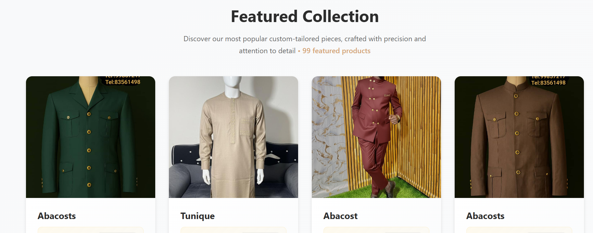
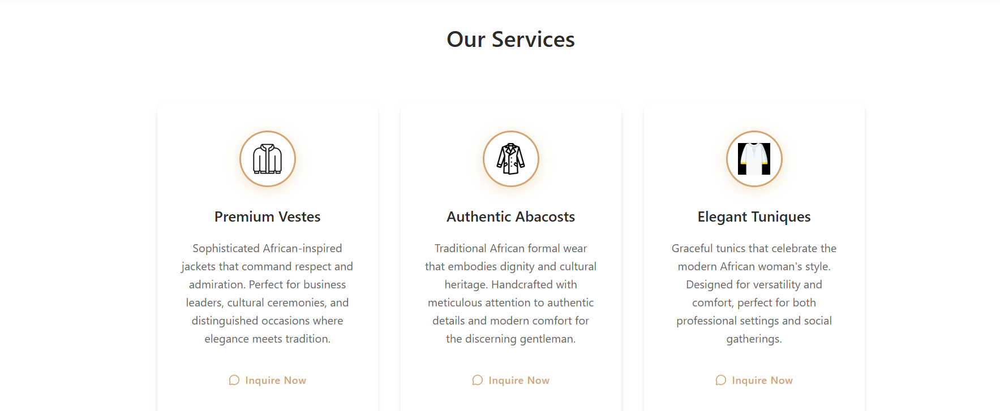
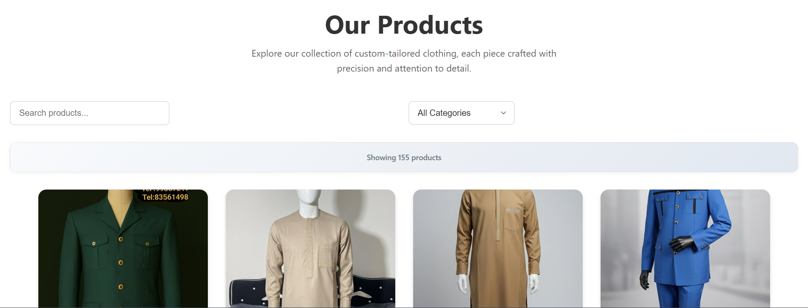
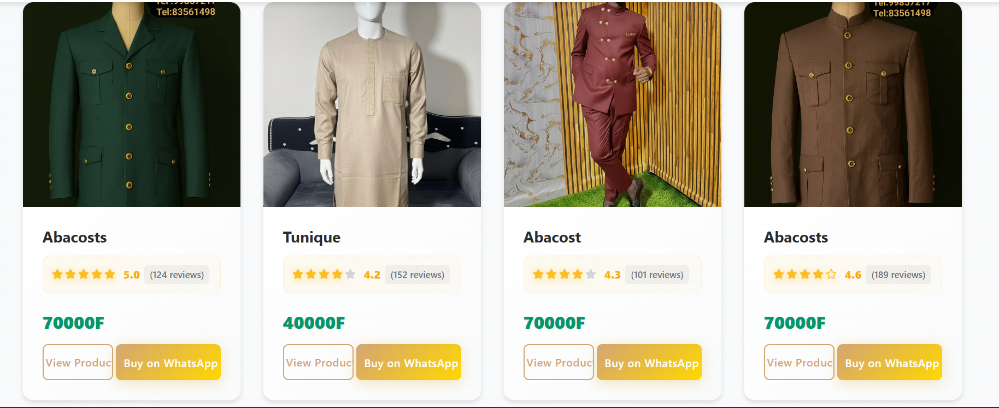
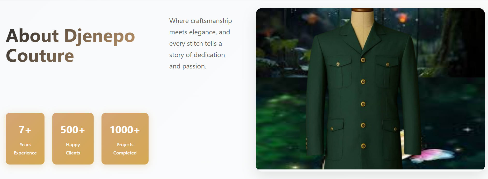
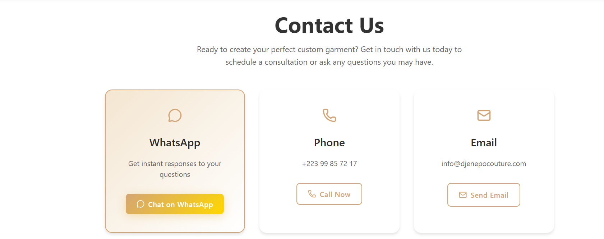
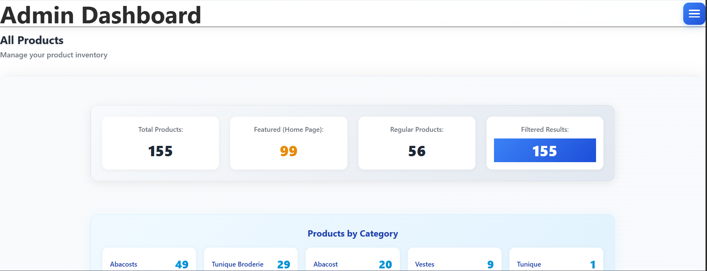
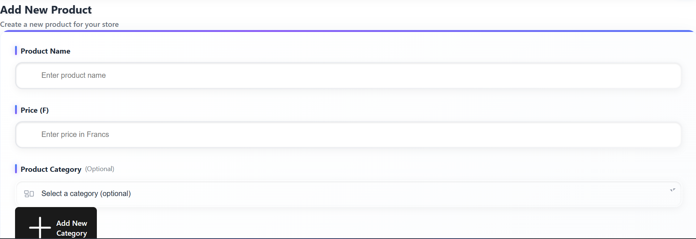

# 👗 Djenepo Couture

> Premium custom tailoring and African fashion — Bamako, Mali 🇲🇱

A full-stack e-commerce web application for **Djenepo Couture**, a bespoke tailoring business specializing in traditional and contemporary African fashion. The site supports bilingual content (English & French), WhatsApp-based ordering, and a secure admin dashboard for managing the product catalog.

---

## 🖼️ Live Preview

### 🏠 Hero Section


---

### ⭐ Featured Collection


---

### 🛍️ Services Section


---

### � Products Page


---

### 🃏 Product Cards


---

### ℹ️ About Page


---

### 📞 Contact Section


---

### 🔐 Admin Login


---

### 🖥️ Admin Dashboard


---

### ➕ Add Product Form


---

## ✨ Features

- �🖼️ **Hero image slideshow** — auto-advances every 3 seconds with manual navigation
- 🛒 **Product catalog** — browse all products with category filtering
- ⭐ **Featured products** — highlighted collection shown on the homepage
- 💬 **WhatsApp ordering** — customers can buy directly via WhatsApp
- 🌍 **Bilingual support** — full English & French translations
- 🔒 **Protected admin dashboard** — Firebase-authenticated admin area
- 📦 **Product management** — add products with image crop, category, price & featured flag
- 🗂️ **Custom categories** — admin can create new categories stored in Firestore
- 🔑 **Change password** — admin can update credentials from the dashboard

---

## 🚀 Tech Stack

| Layer | Technology |
|---|---|
| Frontend Framework | React 18 + Vite |
| Routing | React Router v7 |
| Styling | Vanilla CSS + Tailwind CSS v4 (admin) |
| Icons | Lucide React, Heroicons |
| Backend / Database | Firebase Firestore |
| Authentication | Firebase Auth |
| Image Hosting | Cloudinary |
| Translations | Custom Translation Context (JSON files) |

---

## 📁 Project Structure

```
Djenepocouture/
├── public/
│   ├── images/                   # Logo and static images
│   ├── hero-section.png          # App screenshots
│   ├── featured-collecion.png
│   ├── services-section.png
│   ├── products-page.png
│   ├── products-cards.png
│   ├── about-page.png
│   ├── contact-section.png
│   ├── admin-login.png
│   ├── admin-dashboard.png
│   ├── add-product-from.png
│   ├── robots.txt
│   └── sitemap.xml
├── src/
│   ├── assets/
│   │   └── images/               # Hero & service images (imported in components)
│   ├── components/
│   │   ├── Navbar.jsx / .css
│   │   ├── Footer.jsx / .css
│   │   ├── ProductCard.jsx / .css
│   │   ├── AllProductsSection.jsx / .css
│   │   ├── ImageCropper.jsx / .css
│   │   ├── ChangePasswordModal.jsx / .css
│   │   ├── LanguageToggle.jsx / .css
│   │   ├── ProtectedRoute.jsx
│   │   └── ScrollToTop.jsx
│   ├── contexts/
│   │   ├── AuthContext.jsx        # Firebase auth state
│   │   └── TranslationContext.jsx # EN/FR i18n
│   ├── data/
│   │   └── products.js            # Firestore product fetching
│   ├── pages/
│   │   ├── Home.jsx / .css        # Landing page
│   │   ├── Products.jsx / .css    # Full catalog
│   │   ├── ProductDetail.jsx / .css
│   │   ├── About.jsx / .css
│   │   ├── Contact.jsx / .css
│   │   ├── Login.jsx / .css
│   │   └── Admin.jsx / .css       # Protected dashboard
│   ├── translations/
│   │   ├── en.json                # English strings
│   │   └── fr.json                # French strings
│   ├── firebase.js                # Firebase initialization
│   ├── App.jsx                    # Routes & providers
│   ├── main.jsx                   # Entry point
│   └── index.css                  # Global styles
├── .env.example                   # Environment variable template
├── vite.config.js
└── package.json
```

---

## 🚀 Getting Started

### Prerequisites

- **Node.js** 18.x or higher — [Download](https://nodejs.org/)
- A **Firebase** project — [Firebase Console](https://console.firebase.google.com/)
- A **Cloudinary** account (free tier works) — [cloudinary.com](https://cloudinary.com)

### 1. Clone & Install

```bash
git clone https://github.com/alawantech/Djenepocouture.git
cd Djenepocouture
npm install
```

### 2. Environment Configuration

Copy `.env.example` to `.env` in the root directory and fill in your credentials:

```bash
cp .env.example .env
```

```env
# Firebase Configuration
VITE_FIREBASE_API_KEY=your_api_key_here
VITE_FIREBASE_AUTH_DOMAIN=your_project.firebaseapp.com
VITE_FIREBASE_PROJECT_ID=your_project_id
VITE_FIREBASE_STORAGE_BUCKET=your_project.firebasestorage.app
VITE_FIREBASE_MESSAGING_SENDER_ID=your_sender_id
VITE_FIREBASE_APP_ID=your_app_id
VITE_FIREBASE_MEASUREMENT_ID=your_measurement_id
```

> 💡 Find these values in your **Firebase Console → Project Settings → Your apps**.

> 🖼️ For **Cloudinary**, create an unsigned upload preset named `my_unsigned` in your Cloudinary dashboard and update your cloud name in `src/pages/Admin.jsx`.

### 3. Run Development Server

```bash
npm run dev
```

Open [http://localhost:5173](http://localhost:5173) to view the app in your browser.

---

## 🔥 Firebase Setup

### Firestore Collections

| Collection | Description |
|---|---|
| `products` | All products — name, price, image URL, category, featured flag, rating, reviewCount |
| `categories` | Custom admin-created product categories |


---

## 🖼️ Cloudinary Setup

Product images are uploaded to **Cloudinary** using an unsigned upload preset.

1. Create a free account at [cloudinary.com](https://cloudinary.com)
2. Go to **Settings → Upload → Upload presets**
3. Create an **unsigned preset** named `my_unsigned`
4. Update your cloud name in `src/pages/Admin.jsx` if needed

---

## 📄 Pages

| Route | Page | Description |
|---|---|---|
| `/` | Home | Hero slider, featured products, stats, services |
| `/products` | Products | Full product catalog with category filters |
| `/product/:id` | Product Detail | Individual product info + WhatsApp buy button |
| `/about` | About | Brand story, values, services overview |
| `/contact` | Contact | WhatsApp, phone, email, map, social media |
| `/login` | Admin Login | Firebase authentication form |
| `/admin` | Admin Dashboard | Protected — manage and add products |

---

## 🛍️ Services Offered

| Service | Description |
|---|---|
| 👔 Premium Vestes | African-inspired jackets for formal occasions |
| 🧥 Authentic Abacosts | Traditional African formal wear |
| 👘 Elegant Tuniques | Modern African women's tunics |
| 🪡 Artisanal Broderie | Hand-embroidered tunics with African motifs |
| 👕 Designer Chemises | Contemporary men's dress shirts |

---

## 🌍 Translations

The app supports **English 🇬🇧** and **French 🇫🇷** via a custom `TranslationContext`.

- Translation strings are in `src/translations/en.json` and `src/translations/fr.json`
- The language toggle is available in the navbar on all pages
- To add a new language, create a new JSON file and register it in `TranslationContext.jsx`

---

## 📦 Available Scripts

```bash
npm run dev       # Start development server
npm run build     # Build for production
npm run preview   # Preview production build
npm run lint      # Run ESLint
```

---

## 📞 Contact (Business)

| Method | Details |
|---|---|
| 📱 WhatsApp | [+223 83 56 14 98](https://wa.me/22383561498) |
| 📞 Phone | +223 99 85 72 17 |
| 📧 Email | info@djenepocouture.com |
| 📍 Location | Bamako, Missabougou — près de l'hôpital du Mali |
| 📘 Facebook | [Djenepo Couture](https://www.facebook.com/100076207141933) |
| 🎵 TikTok | [@djenepocouture](https://www.tiktok.com/@djenepocouture) |

---

## 📞 Support & Credits

### Developed By
**Abubakar Lawan**
- 📧 [info@abubakardev.dev](mailto:info@abubakardev.dev)
- 📱 [+234 8100681294](tel:+2348100681294)
- 💻 [GitHub Profile](https://github.com/alawantech)


## 📝 License

© 2025 Djenepo Couture. All rights reserved.
